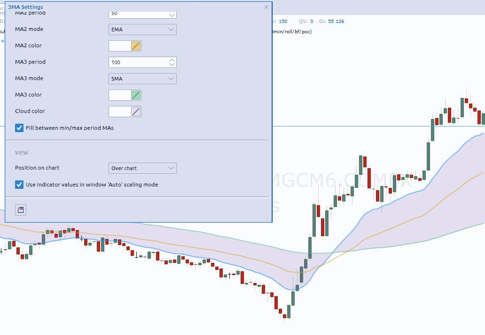

# 3MA Quantower Indicator

Custom Quantower indicator that draws 3 moving averages with configurable type and color.

## Features

- 3 independent moving averages (`MA1`, `MA2`, `MA3`)
- Per-line settings:
  - period
  - mode (`SMA` or `EMA`)
  - color
- Cloud fill between the **minimum-period** and **maximum-period** moving average
- Configurable `Source price` and `Cloud color`

## Inputs

- `Source price`
- `MA1 period`, `MA1 mode`, `MA1 color`
- `MA2 period`, `MA2 mode`, `MA2 color`
- `MA3 period`, `MA3 mode`, `MA3 color`
- `Cloud color`
- `Fill between min/max period MAs`

## Preview



## Build

```bash
dotnet build 3MA.slnx
```

